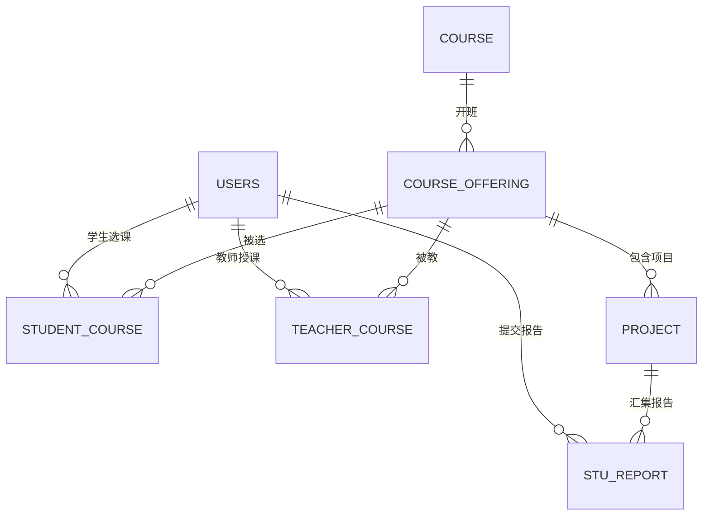

# 实验报告管理系统设计

## 架构与模块设计

### 总体架构

动态 Web 服务：Go 后端（`net/http` + `html/template`），对接 MySQL，可选 TLS 与容器镜像构建。采用严格分层的 Clean Architecture，将 HTTP、业务、数据三层解耦，各层之间仅通过接口或 DTO 通信。

- 前端：`html/template` 服务端渲染 + HTMX 局部刷新（`HX-Redirect`、返回 HTML 片段给模态框和卡片）。
- 后端：分层解耦的 Go 单体服务，装饰器式中间件链围绕自定义 `HandlerFunc` 组装。
- 存储：关系型数据（MySQL）+ 本地文件系统（`./files`）。
- 部署：裸机 + JSON/环境变量配置，或 Docker 容器（Alpine 基础镜像 + ca-certificates）。

### 分层结构

```
server.go            进程入口：加载配置、初始化 DB、依赖注入、监听端口
    │
    ▼
http/router/         路由注册（Router.Init 绑定到 http.ServeMux）
    │
    ▼
http/middleware/     装饰器式中间件：Recovery / Logger / JwtValidator / LoginCheck
    │
    ▼
http/controller.go   HTTP 处理器：解析请求 → 调业务 Service → 调模板
    │
http/view/           将 domain.*View 包装为 *WithUrl（附加操作 URL）
http/template/       HTML 模板渲染（*Generator，读取 html/*.html）
http/route/          URL 生成规则
    │
    ▼
service/             业务逻辑层（service.go 业务 Service + fileservice.go 文件 IO）
    │
    ▼
database/            数据访问层（Repository：UsersRepo/ProjectRepo/ReportRepo/...）
    │
    ▼
internal/domain/     模型与 DTO、视图结构、文件元数据、错误标记（databaserow.go / httpdata.go / serviceData.go）
internal/httperr/    HTTP 错误类型与状态码包装（WithStatus / HTTPStatus）
api/                 对外 DTO（请求/响应 JSON 结构与 JWT 声明）
scripts/init.sql     MySQL schema 初始化脚本
html/                HTML 模板
```

### 请求生命周期

```
Client
  │
  ▼
http.ServeMux（按 METHOD + URL 分派）
  │
  ▼
Adapt(Recovery(Logger(JwtValidator(final))))     需登录端点
Adapt(Recovery(Logger(final)))                   公开端点
Adapt(Recovery(Logger(LoginCheck(JwtValidator(final)))))   站点主页 "/"
  │
  ▼
Controller（http/controller.go）
  - 解析 URL 路径变量、查询参数、JSON body、multipart form
  - 从 context 取出 CtxKeyUserID / CtxKeyRole
  - 转换为 domain.*Data / *Request 后调用 Service
  │
  ▼
Service（service/service.go, fileservice.go）
  - 组合多个 Repo + FileService 完成业务
  - 将扁平 *Info 组装为嵌套 *View（课程→(班级→)项目）
  │
  ▼
Database Repo（database/mysqlHandler.go）
  - SQL 预编译、参数化查询、多行查询走 queryTemplate[T]
  │
  ▼
MySQL
  │
  ▼（返回路径）
Service 返回 *View / *Item / error
  │
  ▼
View 包装（http/view/htmlview.go）→ 生成 *WithUrl
  │
  ▼
Template（http/template/htmlgenerator.go）输出 HTML / HTML 片段
  │
  ▼
Logger 后置记录 → Adapt 捕获 error 并统一写 JSON 错误
```

### 中间件链

围绕自定义 `HandlerFunc = func(w, r) error` 设计，使后置日志中间件可直接拿到下游错误；链尾通过 `Adapt` 适配为标准 `http.HandlerFunc` 挂到 mux。

| 中间件 | 作用 |
| --- | --- |
| `Recovery` | 捕获 panic → 500 error，打印 stack trace |
| `Logger` | 前置记录请求（`[REQ]`），后置记录响应或错误（`[RES]`/`[ERR]`），包含耗时 |
| `JwtValidator` | 校验 `auth_token` cookie 中的 JWT，校验通过后将 `UserID`/`Role` 注入 context |
| `LoginCheck` | 仅作用于 `"/"`：无 JWT 时 302 重定向到 `/sessions` |
| `Adapt` | 链尾适配器：将返回的 `error` 统一交给 `ServeError`（按 `httperr.HTTPStatus` 写状态码，5xx 不暴露内部错误） |

### 启动顺序（server.go）

1. `LoadConfig`：
   - 读 `config.json`；
   - 用环境变量覆盖（`caarlos0/env/v11`）；
   - `LoadJWTSecret`：`JWT_SECRET` 环境变量优先，否则读 `jwt_secret_file`（默认 `./jwt.key`）；
   - `LoadDBPasswd`：`DATABASE_PASSWD` 环境变量优先，否则读 `database_passwd_file`（默认 `./db.pass`）；
   - `applyDefaults`：填充默认监听地址 `127.0.0.1:8080`。
2. `ConnectDB`：
   - 以无 schema 的 DSN 建立临时连接并 `Ping`；
   - `EnsureSchema` 以哨兵表 `LabSystem.Users` 判断是否已初始化，未初始化时按分号拆分执行 `scripts/init.sql`；
   - 用带 schema 的 DSN 重新打开全局 `*sql.DB`。
3. 依赖注入（构造链）：
   `database.*Repo` → `service.*Service`（含 `FileService`）→ `http/template.*Generator` → `http.*Ctl` → `http/router.NewRouter(mux, ctls...).Init()`。
4. `middleware.Secret = []byte(cfg.JWTSecret)` 注入签名密钥。
5. 按 `cfg.EnableTLS` 选择 `http.ListenAndServeTLS`（目前证书路径硬编码为 `server.crt`/`server.key`，TODO）或 `http.ListenAndServe`。

### 关键设计要点

- **Service 依赖小接口**：每个 Service 在 `service/service.go` 内以私有小接口（`authOp` / `teacherProjectOp` / `publicProjectOp` / `projectInfoOp` / `studentInfoOp` / `registerOp` / `courseOp` 等）声明它所需要的 Repo 能力，由 `database/*Repo` 实现。好处：
  - Service 与具体数据库实现解耦；
  - 测试时用 `go-sqlmock` 对 `*sql.DB` 做 mock，直接对 Service 进行单测。
- **泛型查询模板**：`database/queryTemplate[T any]` 抽象多行 `Query → Scan → append` 的样板循环，Repo 只负责提供 SQL、绑定参数、`scanFunc` 闭包。
- **树状视图组织**：Service 把数据库扁平 `StudentProjectInfo` / `TeacherProjectInfo` 用 `indexMap`/`courseIndexMap+classIndexMap` 组装为嵌套 `StudentProjectView`（课程→项目）与 `TeacherProjectView`（课程→班级→项目）。
- **视图 URL 注入**：`http/view/` 把 Service 返回的纯领域视图包装为 `*WithUrl`，在模板渲染时注入按资源生成的操作 URL（遵守 RESTful）。
- **文件元数据与路径安全**：`internal/domain/*Meta`（`StuReportMeta` / `ProjectFileMeta`）封装路径拼接规则，统一经 `filepath.Clean()` + `HasPrefix(baseDir+sep)` 校验，防止目录穿越；基目录为 `./files`。`FileService` 通过小接口 `fileMeta` / `directoryMeta` / `pathGenerator` 接收元数据，不直接接收字符串路径。
- **批量下载**：`FileService.LoadFileBatch` 用 `archive/zip` 流式写入响应，通过 `pathGenerator` 迭代器逐个追加文件；文件名头启用 UTF-8（`Flags |= 0x800`）避免乱码。
- **错误分层**：
  - 领域错误：`domain.ErrAuth` / `ErrNotFound` / `ErrQuery` / `ErrModify` / `ErrNotSafe` / `ErrNotAllow` / `ErrNotExist`；
  - HTTP 错误：`httperr.WithStatus(err, status)` 把状态码绑定到 error，`HTTPStatus(err)` 通过接口断言提取，链尾统一 `ServeError` 写 JSON。
- **SQL 表名安全**：`database/mysqlHandler.go` 顶部 `tabUsers`/`tabCourse`/… 常量，SQL 通过 `fmt.Sprintf` 拼表名、`?` 占位符传值——严禁用用户输入替换 `tab*`。

### 前瞻与 TODO

- HTTP/2、HTTP/3（443 端口 TCP/UDP）支持；TLS 证书路径改为可配置（目前硬编码 `server.crt`/`server.key`）。
- 日志改为文件落地 + 轮转（当前使用标准 `log` 输出到 stderr），**也可扩展发往消息队列**。
- 数据库连接池参数配置（`SetMaxOpenConns` / `SetMaxIdleConns` / `SetConnMaxLifetime`）。
- 批量写（`InsertNewUserBatch`、`InsertStuCourseOfferBatch`）与 `DeleteProject`（删文件 + 删库）使用事务绑定。
- 管理员端的课表导入流程（`manCourseOfferRepo` 已就绪，尚未接入 controller/router）。
- 文件格式白名单 `fileFmtSet` 目前为空 map，需填充（如 `pdf` / `docx` / `zip`）。
- 单份学生报告下载（`Submissions.DownSubmission`）：需在 Repo 上新增 `QueryStuReportFile(reportID)` 能力。
- CSRF 令牌（当前依赖 `SameSite=Lax` 缓解，未实现显式令牌）。
- 忘记密码流程（`PasswordResets` 控制器已占位）。

## 数据库设计

### 概念模型

基本关系：学生到课程多对多、教师到课程多对多、课程到班级多对多、班级到项目一对多、项目到报告一对多。课程与班级通过 `CourseOffering`（开课记录）承载，一次开课对应一门课程下的一个班级一个学期。



关键实体：用户（管理员/教师/学生）、课程、开课（班级）、实验项目、实验报告。

### 表结构

表名与字段以 `scripts/init.sql` 为准，字符集 `utf8mb4` / 排序规则 `utf8mb4_general_ci`。

#### Users（用户）

| 字段 | 类型 | 说明 |
| --- | --- | --- |
| UUID | `int unsigned AUTO_INCREMENT PRIMARY KEY` | 用户主键 |
| identity | `tinyint unsigned NOT NULL` | 身份：1=学生 / 2=教师 / 9=管理员 |
| number | `varchar(16) UNIQUE NOT NULL` | 学号或工号（业务主键，外键目标） |
| name | `varchar(16)` | 姓名 |
| mail | `varchar(32) UNIQUE NOT NULL` | 邮箱 |
| passwd | `varchar(255) NOT NULL` | 加密后的密码 |

`number` 被 `StudentCourse` / `TeacherCourse` / `StuReport` 作为外键引用；`UNIQUE(number)` 本身即可作为唯一索引，无需额外建索引。

#### Course（课程）

| 字段 | 类型 | 说明 |
| --- | --- | --- |
| courseID | `int unsigned AUTO_INCREMENT PRIMARY KEY` | 课程主键 |
| courseName | `varchar(24)` | 课程名 |

#### CourseOffering（开课 / 班级）

承载"某门课程在某学期面向某班级开设"的信息，用于支持一门课开多个班、不同班可有不同项目。

| 字段 | 类型 | 说明 |
| --- | --- | --- |
| offeringID | `int unsigned AUTO_INCREMENT PRIMARY KEY` | 开课主键 |
| courseID | `int unsigned NOT NULL` | 所属课程，`FK → Course(courseID) ON DELETE CASCADE` |
| className | `varchar(32) NOT NULL` | 班级名 |
| term | `varchar(32) NOT NULL` | 学期标识 |

#### StudentCourse（学生选课）

| 字段 | 类型 | 说明 |
| --- | --- | --- |
| studentID | `varchar(16)` | `FK → Users(number) ON DELETE CASCADE` |
| offeringID | `int unsigned NOT NULL` | `FK → CourseOffering(offeringID) ON DELETE CASCADE` |

#### TeacherCourse（教师授课）

| 字段 | 类型 | 说明 |
| --- | --- | --- |
| teacherID | `varchar(16)` | `FK → Users(number) ON DELETE CASCADE` |
| offeringID | `int unsigned NOT NULL` | `FK → CourseOffering(offeringID) ON DELETE CASCADE` |

#### Project（实验项目）

| 字段 | 类型 | 说明 |
| --- | --- | --- |
| projectID | `int unsigned AUTO_INCREMENT PRIMARY KEY` | 项目主键 |
| offeringID | `int unsigned NOT NULL` | 所属开课，`FK → CourseOffering(offeringID) ON DELETE CASCADE` |
| projectName | `varchar(64)` | 项目名 |
| projectFilePath | `varchar(128)` | 项目要求文件在本地 `./files` 下的路径 |
| startTime | `datetime` | 开始时间 |
| deadline | `datetime` | 截止时间 |
| isActive | `bool NOT NULL DEFAULT TRUE` | 开启/关闭状态 |

#### StuReport（学生实验报告）

| 字段 | 类型 | 说明 |
| --- | --- | --- |
| stuReportID | `int unsigned AUTO_INCREMENT PRIMARY KEY` | 报告主键 |
| studentID | `varchar(16) NOT NULL` | `FK → Users(number) ON DELETE CASCADE` |
| projectID | `int unsigned NOT NULL` | `FK → Project(projectID) ON DELETE CASCADE` |
| reportFilePath | `varchar(128)` | 报告文件在本地 `./files` 下的路径 |
| submitTime | `datetime` | 提交时间 |

### 典型查询映射

| 场景 | 涉及表（JOIN 顺序） | Repo 方法 |
| --- | --- | --- |
| 登录身份校验 | `Users` | `QueryPasswd` / `WhoAmI` |
| 学生端项目列表（按课程聚合） | `StudentCourse` → `CourseOffering` → `Course` → `Project` → `StuReport`(left) | `QueryStuProject` |
| 学生端单卡刷新（提交报告后） | `Project` → `CourseOffering` → `Course` → `StuReport`(left) | `QueryStuProjectByID` |
| 教师端项目列表（按课程→班级聚合） | `TeacherCourse` → `CourseOffering` → `Course` → `Project` | `QueryTeacherProject` |
| 项目完成情况 | `StudentCourse` → `CourseOffering` → `Project` → `StuReport`(left) | `QueryStuReportStatus` |
| 新建/删除/开关项目 | `Project`（+ `CourseOffering`/`Course` 查路径） | `AddProject` / `DelProject` / `UpdateProjectFlag` / `QueryOfferingInfo` |
| 项目要求文件读写 | `Project` | `UpdateProjectFile` / `QueryProjectFile` |
| 批量下载学生报告 | `StuReport` | `QueryStuReportFileAll` |

### 索引与约束

- `Users(number)`、`Users(mail)`：`UNIQUE` 约束自动生成唯一索引，覆盖登录校验与按学号查询。
- `Project(offeringID)`：项目列表按开课分组聚合频繁，建立单列非唯一索引（由 `FK` 隐式建立或显式补建）。
- `StuReport(projectID, studentID)`：
  - 覆盖 `QueryStuProjectByID` 的 `p.projectID = srp.projectID AND srp.studentID = ?` 条件；
  - 覆盖 `QueryStuReportStatus` 的按项目统计完成情况；
  - 建议作为唯一组合索引（每个学生对同一项目只保留一份报告；若允许历史版本，则改为非唯一索引 + 时间列）。
- `StuReport(projectID)`：`QueryStuReportFileAll` 按项目批量取路径，若已存在组合索引可复用前缀。
- `CourseOffering(courseID)`、`StudentCourse(studentID)`、`StudentCourse(offeringID)`、`TeacherCourse(teacherID)`、`TeacherCourse(offeringID)`：JOIN 驱动表的外键列，建议显式建立非唯一索引（MySQL 会为外键自动创建匹配索引，但显式声明更稳）。

级联策略：`Users` / `Course` / `CourseOffering` 作为父表统一使用 `ON DELETE CASCADE`，以便用户注销、课程下架、班级解散时相关选课、授课、项目、报告一并清理；应用层负责同步清理本地文件（见安全小节）。

### SQL 操作总览

- 学生端：登录；按课程聚合的项目列表；下载项目要求文件；上传实验报告。
- 教师端：登录；按课程→班级聚合的项目列表；新建/删除/开关项目；上传项目要求文件；查看项目完成情况；下载单份/批量学生报告。
- 管理员端（规划中）：单条/批量注册用户；批量导入选课（学生/教师）；课程与开课的增删。

## 安全概要

本节按威胁类别组织，每项给出现状（代码落点）与改进方向。

### 认证与会话

- **JWT 签发**：`http/controller.go` `Sessions.genShortJWT` 使用 `HS256`，声明结构 `api.LoginJWT`（`UserID` + `Role` + 标准声明），过期时间 30 分钟。
- **密钥注入**：`middleware.Secret` 从 `cfg.JWTSecret` 注入，密钥优先来自环境变量 `JWT_SECRET`，否则从 `jwt.key` 文件读取；`jwt.key`、`db.pass`、`*.exe` 已加入 `.gitignore`。
- **Cookie 标记**：`auth_token` cookie 设置 `HttpOnly` + `SameSite=Lax`，`Path=/`。TODO：TLS 场景下补 `Secure`。
- **校验**：`middleware.JwtValidator` 强校验签名算法为 HMAC 系列，失败统一返回 401；解析通过后把 `UserID`/`Role` 放入 context。
- **密码存储**：`Users.passwd` 目前按明文/预留字段保存，`LoginAuth` 走字符串比对——改进方向是用 `bcrypt`/`argon2id` 加盐哈希 + `subtle.ConstantTimeCompare`。

### 访问控制

- 站点主页 `"/"`：`LoginCheck` 未登录时 302 到 `/sessions`；已登录再走 `JwtValidator` 解析身份，按 `role` 分发到学生/教师主页，未知 role 返回 403。
- 所有 `/api/v1/**`（除 `POST /api/v1/sessions` 登录端点）强制经过 `JwtValidator`。
- TODO：对教师端资源（删除/关闭项目、查看完成情况、批量下载）在 controller 层补齐"角色 + 资源归属"双重校验，防止越权（目前仅确认角色，尚未校验 `projectID` 是否确实归当前 `teacherID` 管理）。

### 注入攻击

- **SQL 注入**：`database/mysqlHandler.go` 全部走 `database/sql` 预编译 + `?` 占位符；表名只使用包级 `tab*` 常量，**绝不用用户输入替换**。批量写使用 `db.Prepare(...).Exec` 复用语句。
- **命令注入**：未调用外部命令；`archive/zip` 走标准库。
- **HTML 注入 / XSS**：统一使用 `html/template`（非 `text/template`），输出自动按上下文转义；模板文件位于 `html/` 目录。
- **HTTP 响应头注入**：从请求中读取的值不直接拼接到响应头；`Content-Disposition` 中的附件名目前为固定字符串 `reports.zip`，若后续改为按用户数据生成，需做 RFC 5987 编码或字符白名单。

### 文件与路径安全

- **路径遍历**：所有文件路径由 `internal/domain/*Meta` 生成，经 `filepath.Clean()` 后再校验是否以 `baseDir + os.PathSeparator` 开头，不通过则返回 `ErrNotSafe`；`FileService` 只接受 `fileMeta` / `directoryMeta` 接口，不接受裸字符串路径。
- **上传大小**：`r.ParseMultipartForm(32 << 20)` 限制 32 MiB，超限返回 400。
- **文件格式白名单**：`domain.fileFmtSet` 已声明但尚未填充，`StuReportMeta.Check` 因此默认拒绝——需要在启动时或包 `init()` 中填入允许的扩展名（如 `pdf`/`docx`/`zip`）。
- **目录权限**：`SaveFile` 使用 `os.MkdirAll(..., 0644)` 创建目录——目录权限位应为 `0755` 或 `0750`（需包含可执行位以允许进入），此为 TODO。
- **文件删除事务**：`DeleteProject` 先删本地目录再删库，失败时不一致；计划包进数据库事务 + 延迟删文件，或使用两阶段标记。

### 传输与基础设施

- **TLS**：`cfg.EnableTLS=true` 时走 `ListenAndServeTLS`，证书路径当前硬编码 `server.crt` / `server.key`（TODO：改为可配置，并支持 Let's Encrypt / 自动续期）。
- **敏感文件忽略**：`.gitignore` / `.dockerignore` 已排除 `*.key`、`*.pem`、`*.crt`、`jwt.key`、`db.pass`、`*.exe`。
- **容器镜像**：基于 `alpine` 的运行镜像，包含 `ca-certificates`；密钥与数据库密码通过挂载文件或环境变量注入，不写入镜像层。
- **配置来源优先级**：环境变量 > 文件 > JSON 默认值，便于在 CI / K8s Secret 场景下覆盖本地配置。

### 日志与错误

- **错误泄露**：`middleware.ServeError` 对 `status >= 500` 的错误统一响应 `"Internal Server Error"`，不回显内部错误字符串；`status < 500` 的错误（4xx）允许回显错误信息，便于前端提示。
- **Panic 隔离**：`middleware.Recovery` 捕获 panic → 500，避免单请求拖垮进程。
- **访问日志**：`Logger` 中间件记录 `METHOD / PATH / RemoteAddr / 耗时 / 状态码`。TODO：落地到轮转文件、对 4xx/5xx 提高采样等级、结构化日志（JSON）以便接入 ELK / Loki。

### 其他风险与改进清单

- **CSRF**：目前依赖 `SameSite=Lax` 缓解，未签发显式 CSRF 令牌。HTMX 提交时可在全局头加 `HX-Request` + 同源校验，或引入同步器令牌模式。
- **暴力破解 / 枚举**：登录端点未限流，也未做登录失败计数。TODO：IP + 账号维度限流，失败日志告警。
- **JWT 撤销**：当前 JWT 无服务端状态，改密或登出后旧 token 仍然可用到过期。TODO：密钥轮换或引入短期 access + 服务端 refresh 列表。
- **依赖与构建**：Go modules 锁定 `go.sum`；Docker 构建使用多阶段 + 最小基础镜像，避免带入编译工具链。
- **备份与恢复**：报告与项目要求文件存于本地 `./files`，需要约定备份策略（例如按日增量）+ 数据库定期 `mysqldump`。
