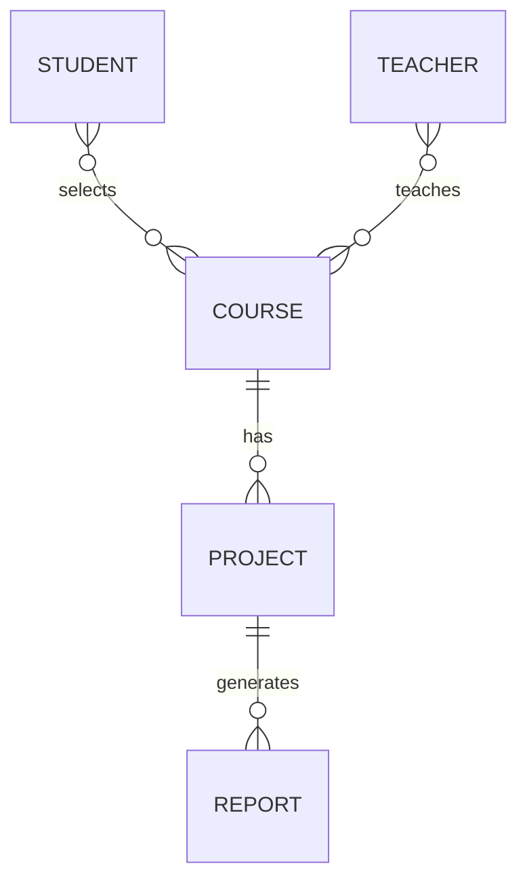

# 实验报告管理系统设计  

## 架构与模块设计  

*  总体架构：动态Web，Golang后端，对接Mysql数据库，可选的容器镜像构建。  

*  基本需求与模块设计：  

1) 根据 URL 路由到前端文件、后端接口——路由模块。（net/http）  
2) 需要生成动态页面——动态web模块。（html/template？）  
3) 实验报告文件在文件系统上的整理——。  
4) 数据库操作，面向对象管理操作语句。    

*  软件架构与小前瞻  

1) 中间件的钩子函数/装饰器（拦截器、身份验证、TLS支持、日志）
2) 基于TLS，对http2与http3的支持（443端口上的TCP与UDP监听）  

## 数据库设计  

### 概念结构  

基本模型：学生到课程多对多，教师到课程多对多，课程到项目一对多，项目到报告一对多。  
教师端视角：教师到课程一对多，课程到学生一对多  
学生端视角：学生到课程一对多  

关键实体：  
1) 用户：管理员、老师、学生。  
2) 实验课的项目。  
3) 学生提交的实验报告。

### 表的结构  

提炼关键实体建立表：
1) 用户表（ID为主键，身份，学号/工号，邮箱，密码）  
2) 实验项目表（ID为主键，项目名，外键所属课程ID，项目要求文件路径，开始时间，截止时间，状态）  
3) 实验报告表（外键所属学生学号，外键所属项目ID，报告文件路径，提交时间）

根据关系建立表：
1) 学生信息表（学号，参加课程）  
2) 教师信息表（工号，管理的课程）  
3) 课程信息表（课程ID，课程名，学期）

### 建立索引  

## 关于安全问题  

1) SQL注入——参数化查询  
2) XSS攻击——Go标准库对页面字符的严格区分。  
3) CSRF攻击——验证码、CSRF令牌  
4) 容器相关？